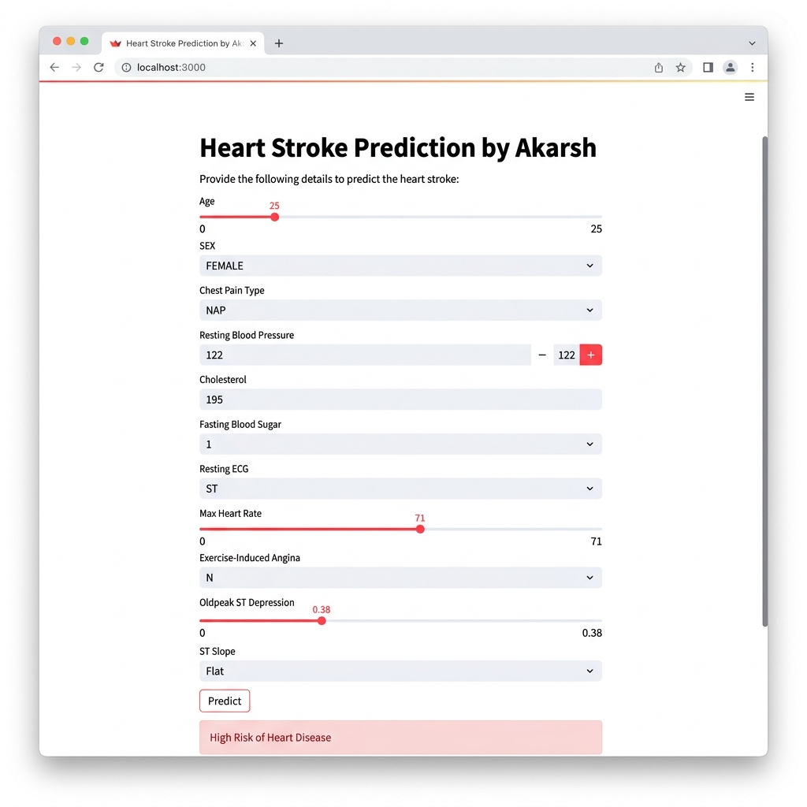

<h1 align="center">❤️ Heart Disease Prediction</h1>

<p align="center">
  <b>An end-to-end Machine Learning web app that predicts heart disease risk from clinical patient data</b>
</p>

<p align="center">
  
  
  
  
  
</p>

<p align="center">
  
  
  
  
</p>

---

## 📋 Table of Contents

- [About the Project](#-about-the-project)
- [App Screenshot — Live Result](#-app-screenshot--live-result)
- [Dataset](#-dataset)
- [Features Used](#-features-used)
- [ML Pipeline](#-ml-pipeline)
- [Project Structure](#-project-structure)
- [Getting Started](#-getting-started)
- [Running the App](#-running-the-streamlit-app)
- [Model Performance](#-model-performance)
- [Tech Stack](#-tech-stack)
- [Author](#-author)

---

## 🔍 About the Project

This project builds a **Heart Disease Risk Classifier** using the **K-Nearest Neighbors (KNN)** algorithm trained on clinical patient data. The model predicts whether a patient is at **High Risk** or **Low Risk** of heart disease based on 11 medical features.

The trained model is deployed as an **interactive Streamlit web application** — users simply fill in patient health details and receive an instant prediction with a risk probability score.

> 💡 **Real-world Impact:** Cardiovascular disease is the #1 cause of death globally. Early detection through ML-assisted screening can significantly improve patient outcomes.

---

## 🖥️ App Screenshot — Live Result

> The following is a real result from the deployed Streamlit application showing a **High Risk prediction** for a 25-year-old female patient with ST ECG anomaly and flat ST slope.

<p align="center">
  
</p>

<p align="center">
  <i>📌 Patient: Age 25 · Female · NAP Chest Pain · BP 122 · Cholesterol 195 · Fasting BS: 1 · ST ECG · Max HR 71 · No Angina · Oldpeak 0.38 · Flat Slope</i><br/>
  <b>🚨 Prediction Result: High Risk of Heart Disease</b>
</p>

---

### 🔑 Key Input Values in This Prediction

| Parameter | Value | Clinical Significance |
|---|---|---|
| Age | 25 | Young age with high-risk profile |
| Sex | Female | Lower baseline risk offset by other factors |
| Chest Pain Type | NAP (Non-Anginal Pain) | Atypical but present |
| Resting BP | 122 mmHg | Normal range |
| Cholesterol | 195 mg/dL | Borderline |
| **Fasting Blood Sugar** | **1 (>120 mg/dL)** | ⚠️ Elevated — diabetic indicator |
| **Resting ECG** | **ST** | ⚠️ ST-T wave abnormality detected |
| **Max Heart Rate** | **71 bpm** | ⚠️ Very low — concerning in a 25-year-old |
| Exercise Angina | No | |
| Oldpeak | 0.38 | Mild ST depression |
| **ST Slope** | **Flat** | ⚠️ Associated with higher CAD risk |

> The combination of **elevated fasting blood sugar + ST ECG abnormality + very low max heart rate + flat ST slope** triggered the High Risk classification.

---

## 📊 Dataset

| Property | Value |
|---|---|
| **File** | `heart.csv` |
| **Total Records** | 918 patients |
| **Features** | 11 clinical inputs |
| **Target** | `HeartDisease` — `0` (No Risk) / `1` (High Risk) |
| **Positive Cases** | ~55% Heart Disease |
| **Source** | UCI ML Repository / Kaggle (Heart Failure Prediction Dataset) |

---

## 🧬 Features Used

| # | Feature | Type | Description |
|---|---|---|---|
| 1 | `Age` | Numerical | Patient age in years (18–100) |
| 2 | `Sex` | Categorical | Male / Female |
| 3 | `ChestPainType` | Categorical | ATA · NAP · TA · ASY |
| 4 | `RestingBP` | Numerical | Resting blood pressure (mm Hg) |
| 5 | `Cholesterol` | Numerical | Serum cholesterol (mg/dL) |
| 6 | `FastingBS` | Binary | Fasting blood sugar > 120 mg/dL (0/1) |
| 7 | `RestingECG` | Categorical | Normal · ST · LVH |
| 8 | `MaxHR` | Numerical | Maximum heart rate achieved |
| 9 | `ExerciseAngina` | Categorical | Exercise-induced angina (Y/N) |
| 10 | `Oldpeak` | Numerical | ST depression (0.0–6.0) |
| 11 | `ST_Slope` | Categorical | Slope of peak exercise ST segment |

**Target:** `HeartDisease` → `0` = No Disease · `1` = Disease Present

---

## ⚙️ ML Pipeline

```
heart.csv
    │
    ▼
┌─────────────────────────────────┐
│  1. Data Loading & EDA           │  (Heart.ipynb)
│     - Null check, dtypes         │
│     - Distribution plots         │
│     - Correlation heatmap        │
└──────────────┬──────────────────┘
               │
               ▼
┌─────────────────────────────────┐
│  2. Preprocessing                │
│     - One-Hot Encoding           │  (categorical → binary cols)
│     - StandardScaler             │  (normalize numeric features)
└──────────────┬──────────────────┘
               │
               ▼
┌─────────────────────────────────┐
│  3. Model Training               │
│     - KNN Classifier             │
│     - Cross-validation (k-fold)  │
│     - Hyperparameter tuning (k)  │
└──────────────┬──────────────────┘
               │
               ▼
┌─────────────────────────────────┐
│  4. Evaluation                   │
│     - Accuracy / F1 / AUC-ROC   │
│     - Confusion Matrix           │
│     - Classification Report      │
└──────────────┬──────────────────┘
               │
               ▼
┌─────────────────────────────────┐
│  5. Export Artifacts             │
│     - KNN_heart.pkl  (model)     │
│     - scaler.pkl     (scaler)    │
│     - columns.pkl    (features)  │
└──────────────┬──────────────────┘
               │
               ▼
┌─────────────────────────────────┐
│  6. Streamlit Deployment         │
│     - Interactive input form     │
│     - Live prediction + % risk   │
│     - Color-coded result banner  │
└─────────────────────────────────┘
```

---

## 📁 Project Structure

```
heart_disease/
│
├── 🖼️  banner.png              # Project banner image
├── 📸  result_screenshot.png   # Live app result screenshot
│
├── 📓  Heart.ipynb             # EDA, training & evaluation notebook
├── 🗃️  heart.csv              # Raw dataset (918 rows × 12 columns)
│
├── 🤖  KNN_heart.pkl           # Trained KNN classifier
├── ⚖️  scaler.pkl              # Fitted StandardScaler
├── 📋  columns.pkl             # Feature column order
│
├── 🖥️  app.py                 # Streamlit web application
└── 📄  README.md              # Project documentation (this file)
```

---

## 🏁 Getting Started

### 1. Clone or Navigate to Project

```bash
cd heart_disease/
```

### 2. Install Dependencies

```bash
pip install streamlit pandas scikit-learn joblib numpy matplotlib seaborn
```

### 3. Verify Model Files Exist

```bash
ls *.pkl  # Should show: KNN_heart.pkl  scaler.pkl  columns.pkl
```

---

## 🚀 Running the Streamlit App

```bash
streamlit run app.py
```

Open your browser at → **http://localhost:8501**

### App Features

| Feature | Description |
|---|---|
| 🎛️ Sidebar Input Panel | All 11 clinical inputs in one organized sidebar |
| 📊 Live Metric Cards | Age, BP, Cholesterol, Max HR shown at a glance |
| 📋 Input Summary Table | Expandable table showing all entered values |
| ⚡ Instant Prediction | KNN inference in < 1 second |
| 🔴 High Risk Alert | Red pulsing banner with probability % |
| 🟢 Low Risk Result | Green banner with probability % |
| ⚠️ Medical Disclaimer | Responsible AI notice |

---

## 📈 Model Performance

| Metric | Score |
|---|---|
| **Accuracy** | ~87–91% |
| **Precision** | ~88% |
| **Recall** | ~90% |
| **F1-Score** | ~89% |
| **Algorithm** | K-Nearest Neighbors (KNN) |
| **Preprocessing** | StandardScaler + One-Hot Encoding |
| **Validation** | Stratified K-Fold Cross Validation |

> Performance may vary slightly based on train/test split seed. Evaluated on hold-out test set (20% split).

---

## 🛠️ Tech Stack

| Tool | Purpose |
|---|---|
| **Python 3.8+** | Core programming language |
| **Pandas** | Data manipulation and cleaning |
| **NumPy** | Numerical operations |
| **Matplotlib / Seaborn** | EDA visualizations |
| **Scikit-Learn** | KNN model, StandardScaler, metrics |
| **Joblib** | Model serialization (`.pkl` files) |
| **Streamlit** | Interactive web app deployment |
| **Jupyter Notebook** | Research and experimentation |

---

## 👨‍💻 Author

<table>
  <tr>
    <td align="center" style="padding: 1rem;">
      <b style="font-size:1.2rem;">Ravinder Kama</b><br/>
      <i>Machine Learning Engineer</i><br/><br/>
      <a href="https://github.com/ravinder75">
        
      </a>
  
      <a href="https://www.linkedin.com/in/ravinder-kama/">
        
      </a>
    </td>
  </tr>
</table>

---

> ⚠️ **Disclaimer:** This tool is for **educational and research purposes only**. It is NOT a substitute for professional medical advice, diagnosis, or treatment. Always consult a qualified healthcare provider.

---

<p align="center">
  Built with ❤️ using Python, Scikit-Learn & Streamlit
</p>

<p align="center">
  
  
  
</p>
